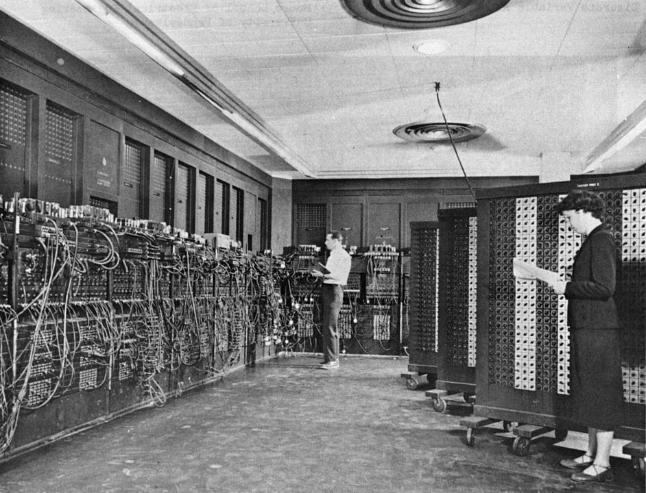

# 02. Computational Thinking
October 19, 2020

## Agenda
1. [Business & Updates](#meeting-notes)
2. [Workflow for adding updates & notes](#updates-workflow)
3. [Command line tutorial](#command-line)
3. [For next time](#for-next-time)

## Meeting notes
Note-taker: Kristen

Note-taking responsibilities will rotate, in first-name alphabetical order (Thu next session, then Zach, then Alice)

## how computers work videos
>> we didn't know basically any of this 
  >> Zach appreciates why maybe don't have 1000 apps open at once
  >> idea of computer language new (talking to computer without a GUI) 
>> what did we know?
>> questions?
  >> what stops *them* from editing any code in any computer?
  >> answer: some people do (see Linux)
    >> risk of breaking something or creating a vulnerability
    >> plus just hard
  >> Intellectual property issues may prevent code editing 
  >> How was programming language developed?
    >> a Programming language is a program that allows you to write other programs
    >> usually happens within a community of developers
      >> see Pandoc, file conversion tool
>> did the information in these videos make you think differently about anything you do?
  >> allayed some concerns for Zach
  >> Alice: no one is "tech savvy." People just have different confidence
>> Understanding how computers understand information
  >> Computers are good at counting and indexing 

## The Command Line
>> In either git bash or terminal
>> folder = directory
>> different operating systems organize files differently 

### Business
- Announcements
- Individual updates and questions

### Updates workflow

How to add your individual updates:

- Navigate to the [GitHub repository](https://github.com/digbmc/dsgf-20-21) for this site and then to the **logs** folder

- Download the file **sample.md** (click **Raw** and then **save as** wherever you keep your files for this group)

- Open it up in your Atom text editor and save the file as **name.md** (your first name)

- Edit the file to add your name and a few updates for this week

- Pay attention to the syntax highlighting and follow the example when you add content

- When you're done, return to the GitHub repository. Use the branch dropdown menu (labeled **master**) and create a new branch. Name it something short (your initials or first name). This is your personal version of the repository.

- In the **logs** folder, select **Add file** and **Upload files**

- Write a brief comment to summarize your change (i.e. 'updates for 10/19') and select **commit changes**

- Your updates will only be visible on your personal branch unless you create a **pull request** to merge them with the main branch

How to publish meeting notes:

1. Navigate to the GitHub page and make sure you switch to the **master** branch.

2. Download the markdown file for today's session.

3. Use Markdown syntax to add your own notes. Save the document.

4. Return to GitHub and add the file in the same place while you're on your personal branch

5. Navigate to **Pull requests** and click **new pull request**

6. Select master as your base branch and your personal branch as your compare branch

7. Select **Create pull request** and write a brief summary of the changes (i.e. 'notes from 10/19 session')

### Discussion

 [Code.org](https://www.youtube.com/watch?v=OAx_6-wdslM&list=PLzdnOPI1iJNcsRwJhvksEo1tJqjIqWbN-) videos

### Command line

- Installations:
  - [Xcode/git](https://github.com/tri-cods/install/blob/master/sections/git.md)
  - [Atom](https://github.com/tri-cods/install/blob/master/sections/atom.md)
- [Tutorial from DSRI](https://github.com/tri-cods/command-line)

#### Resources
- [Introduction to the Bash Command Line](https://programminghistorian.org/en/lessons/intro-to-bash), Ian Milligan and James Baker, The Programming Historian
- [The Unix Shell](http://swcarpentry.github.io/shell-novice/) (for more advanced tutorials, see the “Loops” and “Shell Scripts” sections)
- [Terminus command line game](http://web.mit.edu/mprat/Public/web/Terminus/Web/main.html) (a fantasy choose-your-own adventure like game) (good for getting use to navigating file structures--uses only a few commands)
- https://vim-adventures.com/
- https://codecombat.com/

## For next time
- Add your updates by Monday morning 11/2
- Readings on DH in your discipline
  - [Archaeology, the Digital Humanities, and the 'Big Tent'](https://dhdebates.gc.cuny.edu/read/untitled/section/abdd0db0-2eaa-4af7-aac3-7f24ca70ed3b), Ethan Watrall, *Debates in the Digital Humanities 2016* (Minnesota UP: 2016)
  - ["Digital Methods and Classical Studies"](http://www.digitalhumanities.org/dhq/vol/10/2/000253/000253.html), Bernstein and Coffee, DHQ 10.2 (2016)
- Find additional resources, projects, and readings relevant to your sub-discipline
- Optional:
  - [Introduction to the command line (LinkedIn Learning tutorial)](https://www.linkedin.com/learning/learning-linux-command-line-2/)
  - play [Terminus](https://web.mit.edu/mprat/Public/web/Terminus/Web/main.html)

[<<< Previous](/01-intro.md) | Next >>>

[Return to syllabus](../syllabus.md)

[Home](../README.md)

Image:
ENIAC (Electronic Numerical Integrator And Computer, By Unknown author - U.S. Army Photo, Public Domain, https://commons.wikimedia.org/w/index.php?curid=55124
